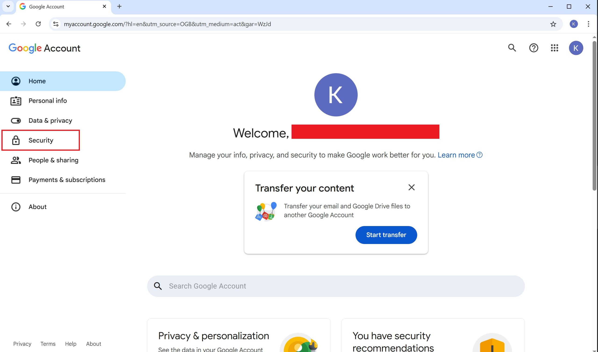
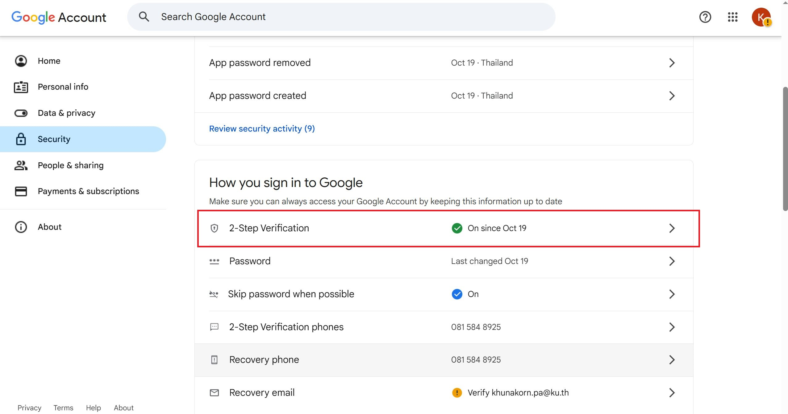
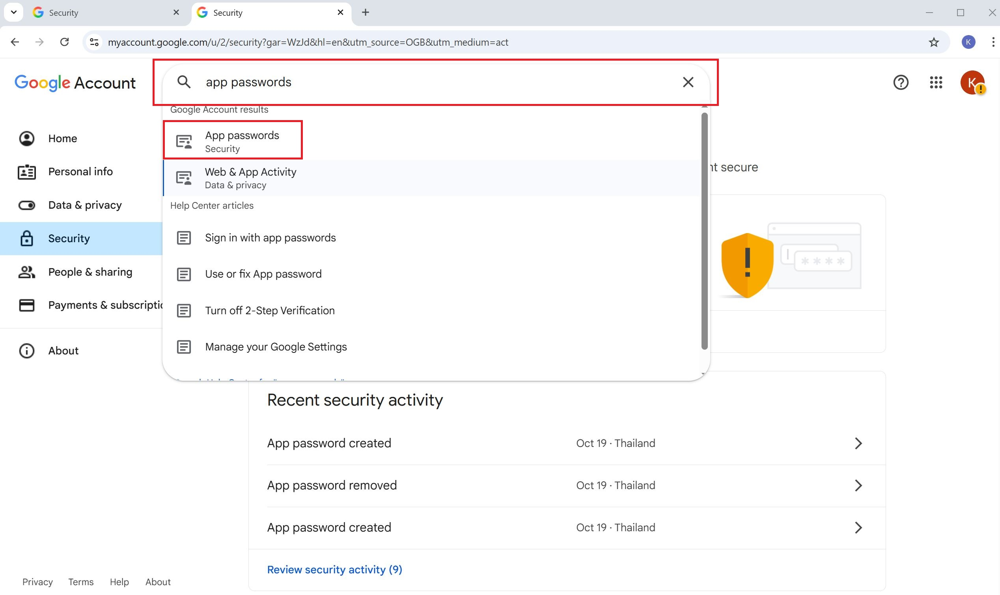
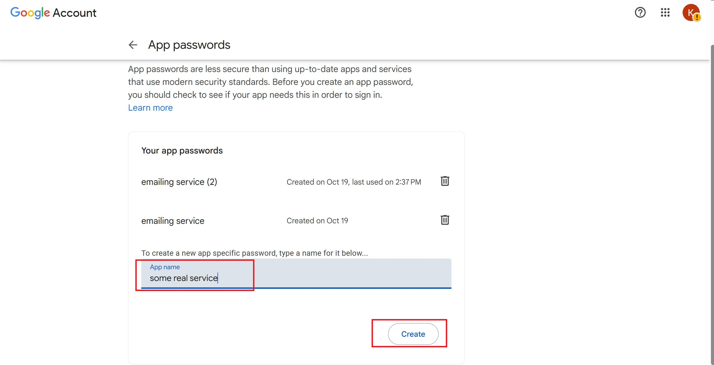
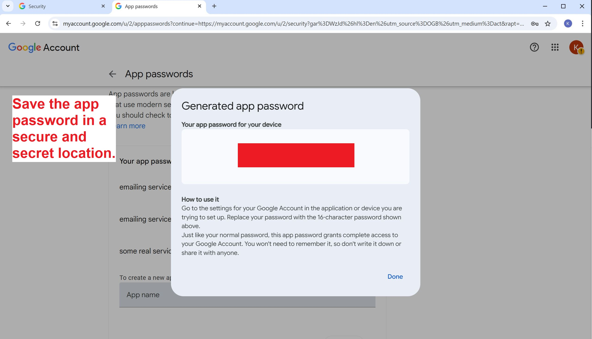

## Setting up the mailing service using Gmail

This short guide will tell you how to configure your Google account to allow sending emails with Gmail's SMTP server

### Set up your Google account

1. Go to the [manage your Google account page](https://myaccount.google.com/) and navigate to the security page
 

1. If you haven't already setup 2-factor verification for the account. If 2FA is already activated proceed to step 3
 

1. Type `app password` into the search bar and navigate to the tab
 

1. Input a name for the app password such as `mailing service` and click create
 

1. View the created password and ensure that the password is memorized before closing the dialogue box, as the password is shown only once.
 

### Configuring the .env
1. Fill out the following variables in the `.env` file
- `SERVICE_EMAIL = <the account for sending emails>`
- `EMAIL_PASSWORD = <the created app password>`
