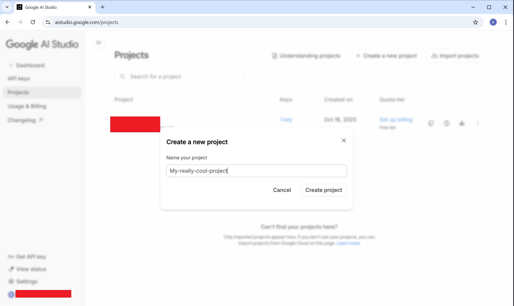

## Setting up the admin service with Gemini API

This short guide will tell you how to create a Gemini project and obtain a Gemini API key.

### Creating a Gemini project

1. Navigate to [Google AI studio's homepage](https://aistudio.google.com/) and go to the dashboard
 

1. Go to the Projects tab and create a new project
 
 

1. Go to the API keys tab and create a new API key, ensure you select the created project
 
 

1. Find the created key and click the link to see the key's information
 

7. Copy the key and put it in the `.env` file as `GEMINI_KEY = <some key here>`
 
